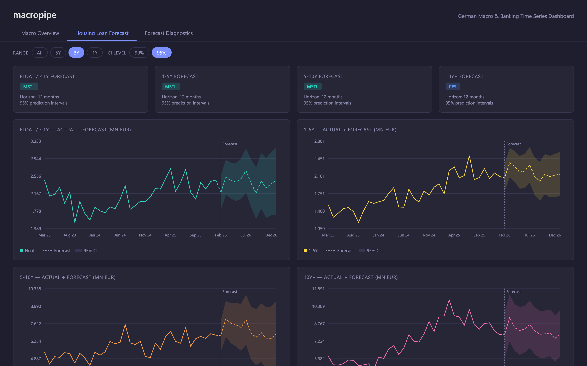

# macropipe

<p align="center">
  
  
  
  
  
  
  
</p>

<p align="center">
  End-to-end macro data pipeline — Bundesbank SDMX → dbt/DuckDB → time series forecasting → PowerBI semantic model
</p>

---

## What it does

Fetches 30 German macro and banking time series from the Bundesbank SDMX API, runs them through a three-layer dbt transformation pipeline on DuckDB, fits cross-validation-selected forecasting models on housing loan volumes, and surfaces everything through a PowerBI TMDL semantic model with 20+ DAX measures and a standalone HTML dashboard.

## Architecture

```
Bundesbank SDMX API
        │
        ▼
  python/fetch.py          ← HTTP GET → lxml XML parse → DataFrame
        │
        ▼
   DuckDB (raw.*)          ← 30 series stored as raw tables
        │
        ▼
   dbt pipeline            ← staging (view) → intermediate (table) → marts (table)
        │
        ▼
  python/forecast.py       ← statsforecast CV → best model per series → 12m forecast
        │
        ▼
   DuckDB (forecast.*)     ← forecasts + CV metrics + run metadata
        │
        ▼
   dbt marts rebuild       ← unions actuals + forecasts into fct_macro_series
        │
        ├──▶ dashboard.html    ← standalone HTML dashboard (prototype / first draft)
        │
        └──▶ PowerBI (.pbip)   ← TMDL semantic model + report (production target)
```

## HTML Dashboard (Prototype)

A self-contained HTML dashboard (`dashboard.html`) serves as the first-draft wireframe for the project. It reads `data/dashboard_data.json` directly and renders three pages — Macro Overview, Housing Loan Forecast, and Forecast Diagnostics — with interactive filters (date range, CI level). No build step or dependencies required; open in any browser while serving the repo directory.

The PowerBI semantic model and report definition are the production target and mirror the same three-page layout with full DAX time intelligence and calculation groups.



---

## Data Sources

30 Bundesbank time series from 2010 onwards, fetched via the SDMX 2.1 Generic XML API:

| Segment | Series | Source |
|---------|--------|--------|
| Macro context | GDP, Inflation (HICP), ECB MRO/Deposit/Marginal rates, EURIBOR 3M, Svensson 2Y/10Y yields | BBNZ1, BBDP1, BBIN1, BBIG1, BBSIS |
| Housing loans (households) | 5 rates (APRC total + 4 maturity buckets) + 5 volumes (total + 4 maturity buckets) | BBIM1 (SUD131, SUD116-119, SUD231, SUD216-219) |
| NFI loans (non-financial corps) | 6 rates (total + 3 size × 2 maturity) + 6 volumes (total + 3 size × 2 maturity) | BBIM1 (SUD939A, SUD124-129, SUD949A, SUD224-229) |

> **Note on APRC:** The housing loan rate total (SUD131) is APRC, not the pure interest rate. APRC includes fees/costs and cannot be validated as a weighted average of the maturity sub-buckets. Volume totals are validated as the sum of their buckets.

---

## Pipeline Steps

### 1. Fetch — `python/fetch.py`

- Hits the Bundesbank REST endpoint per series defined in `python/config.py`
- Parses SDMX 2.1 Generic XML with `lxml.etree` and namespace-aware XPath
- Stores each series as a separate table in the DuckDB `raw` schema

### 2. Transform — dbt

Three-layer dbt architecture on `dbt-duckdb`:

| Layer | Model | Description |
|---|---|---|
| Staging | `stg_bundesbank.sql` | Unions all 30 raw tables into tidy format: `series_name`, `time_period`, `value` |
| Intermediate | `int_series_cleaned.sql` | Parses quarterly (`2023-Q1`) and monthly (`2023-01`) periods into `DATE`, filters nulls |
| Marts | `fct_macro_series.sql` | BI-ready fact table — actuals ∪ forecasts with CI bands; `pre_hook` guards first-run schema |

### 3. Forecast — `python/forecast.py`

Forecasts 5 housing loan new-business volume series (total + 4 maturity buckets):

| Parameter | Value |
|---|---|
| Candidate models | AutoARIMA, AutoETS, AutoTheta, AutoCES, MSTL, SeasonalNaive |
| CV strategy | Expanding window — `min_train=60`, `step=6`, `h=12` |
| Metrics | MAE, RMSE, MAPE, SMAPE per (series, model) across all folds |
| Model selection | Lowest RMSE; tie-break on MAE — per series |
| Output | 12-month point forecast with 90% and 95% prediction intervals |

Results stored in `forecast.hl_vol_forecasts`, `forecast.hl_vol_cv_metrics`, `forecast.hl_vol_run_metadata`.

### 4. Validate — `python/validate.py`

- Volume totals must equal sum of maturity buckets (1% tolerance)
- NFI rate total must approximate volume-weighted average of rate buckets (10 bps tolerance)
- HL rate total (APRC) explicitly excluded from rate-bucket validation by design

---

## PowerBI Semantic Model

TMDL-based semantic model in `powerbi/macropipe.SemanticModel/`:

| Component | Detail |
|---|---|
| Fact table | `fct_macro_series` — DuckDB via `DuckDB.Contents()` M connector, 11 columns incl. CI bands |
| Date dimension | `synth_dim_date` — DAX-generated from `MIN/MAX(fct_macro_series[period_date])` |
| Relationship | `fct_macro_series.period_date` → `synth_dim_date.Date` (both-direction cross-filter) |
| Measures | 20+ DAX in `_Measures`: base values, CI bands, YTD/QTD/Rolling 12M, YoY/MoM, diagnostics |
| Calculation group | `CG - Time Intelligence` — 15 items (Current, MTD/QTD/YTD, PY variants, YoY/MoM, Rolling 12M) |

### Report Pages

| Page | Visuals |
|------|---------|
| **Macro Overview** | 4 KPI cards (ECB MRO, Inflation, EURIBOR 3M, 10Y Yield) + ECB rates line chart + yield curve + HL APRC rates + HL volume stacked bar |
| **Housing Loan Forecast** | 4 line charts (Float, 1-5Y, 5-10Y, 10Y+) — ACT + FCT with 95% CI bands |
| **Forecast Diagnostics** | Forecast summary table + combined HL volume overlay with 90% CI |

---

## Quick Start

```bash
# Create virtual environment and install dependencies
make setup

# Run the full pipeline: fetch → dbt → forecast → dbt (rebuild) → test
make full

# Or step by step
make fetch        # Pull 30 series from Bundesbank API
make transform    # Run dbt (staging → intermediate → marts)
make forecast     # Fit CV models, write forecasts to DuckDB
make test         # Run dbt tests + validation checks

# Serve the HTML dashboard locally
python serve.py

# Clean generated artifacts
make clean
```

### Requirements

- Python 3.10+
- DuckDB connector for Power BI Desktop (to open the `.pbip`)
- Internet access for Bundesbank SDMX API

### Dependencies

```
duckdb==1.2.1        dbt-duckdb==1.9.1    pandas==2.2.3
requests==2.32.3     lxml==5.3.1          statsforecast==2.0.1
numpy==1.26.4
```

---

## Agentic Workflow — Cost vs. Human Benchmark

This project was built in a single ~3 hour Claude Opus session (one context reset included).

| Scenario | Cost | Calendar time | Notes |
|---|---|---|---|
| **Claude Opus API** | **~€26** | **3 hours** | Full project, complete |
| Senior analyst (same 3h) | €184 | 3 hours | ~15–20% of scope delivered |
| Senior analyst (full build) | €3,660 | ~8 working days | Solo, fully loaded cost |
| Full data team (4 roles + PM + QA) | €8,010 | 1–2 weeks | Market rate engagement |

**141× cheaper than a solo analyst. 308× cheaper than a full team. 20× faster.**

Rates based on fully loaded European DACH market costs (×1.35 on gross): senior data engineer €80k/year → €61/h. Token estimate: ~1.75M input + ~125k output, central cost ~€26 with prompt caching.

> Full methodology, assumptions and caveats: [COST_ANALYSIS.md](COST_ANALYSIS.md)

---

## Project Structure

```
macropipe/
├── orchestrate.py              # CLI pipeline orchestrator (fetch|transform|forecast|test|full)
├── dashboard.html              # Standalone HTML dashboard (prototype wireframe)
├── data/
│   ├── macropipe.duckdb        # DuckDB analytical warehouse
│   └── dashboard_data.json     # JSON export for the HTML dashboard
├── python/
│   ├── config.py               # Series registry (30 series) + DB path config
│   ├── fetch.py                # Bundesbank SDMX fetcher + DuckDB raw storage
│   ├── forecast.py             # CV-based forecasting (statsforecast)
│   └── validate.py             # Volume/rate total validation
├── models/
│   ├── staging/
│   │   ├── stg_bundesbank.sql  # Union 30 raw tables → tidy format
│   │   └── schema.yml          # Source definitions for all raw tables
│   ├── intermediate/
│   │   ├── int_series_cleaned.sql  # Date parsing + null filtering
│   │   └── schema.yml
│   └── marts/
│       ├── fct_macro_series.sql    # Actuals ∪ forecasts (with CI bands)
│       └── schema.yml
├── powerbi/
│   ├── macropipe.pbip              # PowerBI project entry point
│   ├── macropipe.SemanticModel/    # TMDL semantic model definition
│   │   └── definition/
│   │       ├── model.tmdl
│   │       ├── tables/             # fct_macro_series, synth_dim_date, _Measures, CG
│   │       └── relationships/      # rel_fct_date
│   └── macropipe.Report/           # Report wireframe (3 pages, 14 visuals)
│       └── definition/pages/
├── docs/
│   └── forecast_3y.png             # Housing Loan Forecast — 3Y view
├── COST_ANALYSIS.md                # Agentic workflow cost vs. human benchmark
├── REFERENCE.md                    # Technical reference (connectors, DAX, M, API)
├── dbt_project.yml
├── profiles.yml
├── requirements.txt
└── Makefile
```
